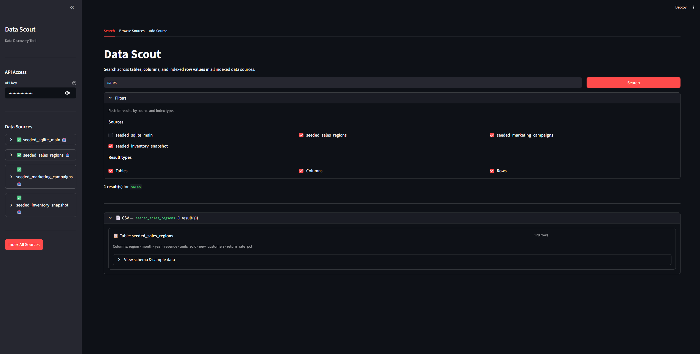
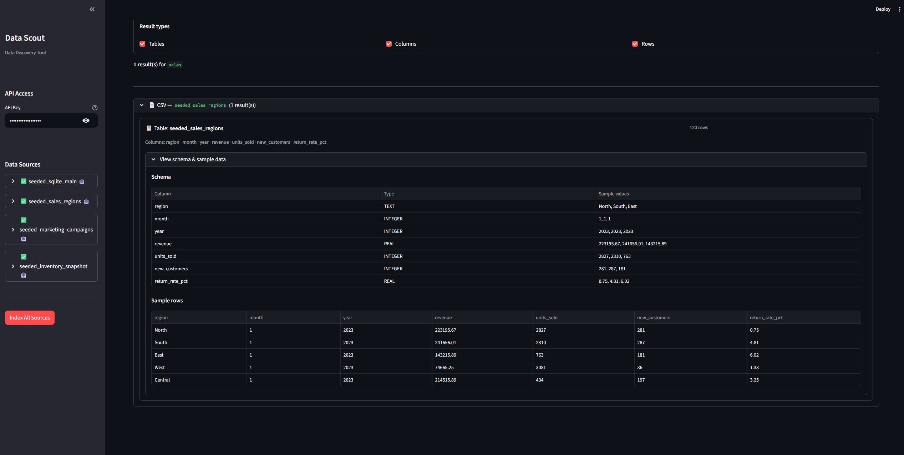
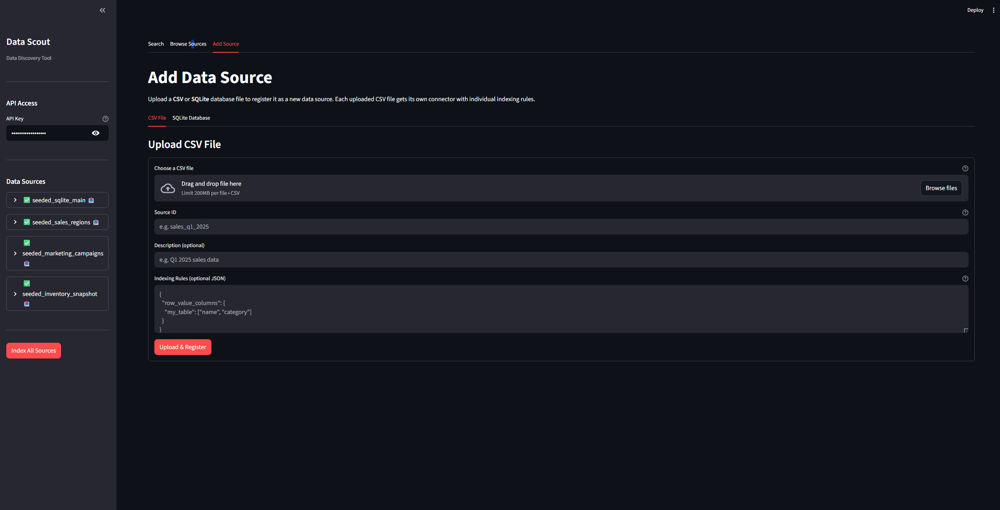

# MCP Data Scout

A **Data Discovery Tool** built as an MCP (Model Context Protocol) server.
Allows AI agents and humans to search for tables, columns, and data across multiple data sources (CSV/Sqlite) with ability to upload new data sources.

## 📋 Navigation

- [Quick Start](#quick-start)
- [MCP Quick Test](#mcp-quick-test)
- [Architecture](#architecture)
  - [Component breakdown](#component-breakdown)
- [Seeded data description](#seeded-data-description)
- [Adding Your Own Data](#adding-your-own-data)
  - [Via the Web UI](#via-the-web-ui)
  - [Indexing Rules JSON](#indexing-rules-json)
- [MCP Tools](#mcp-tools)
  - [`list_sources()`](#list_sources)
  - [`index_source(source_id)`](#index_sourcesource_id)
  - [`search(query, limit?, source_ids?, match_types?)`](#searchquery-limit-source_ids-match_types)
  - [`get_schema(source_id, path)`](#get_schemasource_id-path)
- [REST API](#rest-api)
- [Connecting an AI Agent](#connecting-an-ai-agent)
  - [Claude Desktop / Cursor](#claude-desktop--cursor)
- [Project Structure](#project-structure)
- [Environment Variables](#environment-variables)
- [Search Index Design](#search-index-design)

---

## Quick Start

```bash
git clone https://github.com/ArgentumX/mcp-data-scout.git
```

```bash
cd mcp-data-scout
```

```bash
cp .env.example .env
```

```bash
docker compose up --build
```

- **Streamlit UI**: http://localhost:8501
- **REST API / MCP server**: http://localhost:8000
- **API docs**: http://localhost:8000/docs

On first startup the server auto-generates sample data if env var SEED is "true" (SQLite + CSV).
Enter `MASTER_API_KEY` from `.env` to field

Then click **"Index All Sources"** in the frontend sidebar to index them.




---

## MCP Quick Test

start mcp-data-scout (Quick Start)

```bash
cd mcp-test
```

```bash
docker build -t mcp-data-scout-test .
```

```bash
docker run --network host mcp-data-scout-test
```
---

## Architecture

```
┌─────────────────────────────────────────────────────┐
│                   Docker Compose                     │
│                                                     │
│  ┌──────────────────┐      ┌──────────────────────┐ │
│  │   data-scout-ui  │      │   data-scout-mcp     │ │
│  │   (Streamlit)    │─────▶│   (FastAPI + MCP)    │ │
│  │   port 8501      │ HTTP │   port 8000          │ │
│  └──────────────────┘      └──────────┬───────────┘ │
│                                       │             │
│                             ┌─────────▼──────────┐  │
│                             │   /data  (volume)  │  │
│                             │   uploads/         │  │
│                             │   sqlite_main.db   │  │
│                             │   *.csv            │  │
│                             │   index.db (FTS5)  │  │
│                             │   sources.json     │  │
│                             └────────────────────┘  │
└─────────────────────────────────────────────────────┘
```

### Component breakdown

| Layer | Module | Responsibility |
|-------|--------|----------------|
| **Connectors** | `connectors/` | Read schemas & data from sources |
| **IndexingRules** | `connectors/abstraction/base.py` | Customizes indexing rules for each single connector |
| **BaseConnector** | `connectors/abstraction/base.py` | Base abstract data source connector class |
| **CSVConnector** | `connectors/csv_connector.py` | Single-file CSV connector |
| **SQLiteConnector** | `connectors/sqlite_connector.py` | Single-file SQLite connector |
| **Indexer** | `index/indexer.py` | Store metadata in SQLite FTS5 index |
| **Search** | `search/engine.py` | Full-text + LIKE search over metadata |
| **MCP Tools** | `server/mcp_app.py` | FastMCP tool definitions (SSE endpoint) |
| **REST API** | `server/api_app.py` | FastAPI endpoints for Streamlit UI |
| **UI** | `frontend/app.py` | Streamlit web interface |
| **Registry** | `server/source_registry.py` | Manages connector instances + manifest persistence |

---

## Seeded data description

| ID | Type | Description |
|----|------|-------------|
| `seeded_sqlite_main` | SQLite | Business database: customers, orders, products, employees, order_items |
| `seeded_sales_regions` | CSV | Regional sales data |
| `seeded_marketing_campaigns` | CSV | Marketing campaign performance data |
| `seeded_inventory_snapshot` | CSV | Inventory snapshot across warehouses |

---

## Adding Your Own Data

### Via the Web UI

Open the **Add Source** tab in the Streamlit UI:

1. **CSV File** — upload any `.csv` file, give it a unique Source ID, and optionally provide Indexing Rules as JSON.
2. **SQLite Database** — upload a `.db` / `.sqlite` file, give it a unique Source ID, and optionally provide Indexing Rules.

Uploaded files are stored under `/data/uploads/` and survive container restarts thanks to the
sources manifest at `/data/sources.json`.

After uploading, click **Index now** next to the new source in the sidebar.

### Indexing Rules JSON

Each uploaded source can have its own indexing rules that control what gets indexed
and whether row values are searchable. All fields are optional.

```json
{
  "include_tables": ["sales", "products"],
  "exclude_tables": ["logs", "audit"],
  "exclude_columns": {
    "users": ["password_hash", "token"]
  },
  "row_value_tables": ["products", "orders"],
  "row_value_columns": {
    "products": ["name", "category"],
    "orders": ["status", "shipping_city"]
  }
}
```

| Field | Type | Effect |
|---|---|---|
| `include_tables` | list of strings | Index only these tables |
| `exclude_tables` | list of strings | Skip these tables |
| `include_columns` | `{table: [cols]}` | Index only listed columns per table |
| `exclude_columns` | `{table: [cols]}` | Skip listed columns per table |
| `row_value_tables` | list of strings | Enable row-value indexing for these tables |
| `row_value_columns` | `{table: [cols]}` | Index these columns as searchable row values |

Leave blank or `{}` to index everything with no restrictions.

---

## MCP Tools

The server exposes MCP tools at `http://localhost:8000/mcp/sse`:

### `list_sources()`
Returns all registered data sources with indexing status.

```json
[
  {
    "source_id": "sqlite_main",
    "source_type": "sqlite",
    "description": "Main SQLite database with business data",
    "location": "/data/uploads/sqlite_main.db",
    "is_indexed": true
  }
]
```

### `index_source(source_id)`
Reads schema from a source and stores metadata in the FTS5 index.

```json
{ "success": true, "source_id": "sqlite_main", "tables_indexed": 5 }
```

### `search(query, limit?, source_ids?, match_types?)`
Full-text search across table names, column names, and indexed row values.
Returns ranked results grouped by match type (table → column → row).

```json
[
  {
    "match_type": "table",
    "source_id": "sqlite_main",
    "table_name": "customers",
    "row_count": 200,
    "columns": [{"name": "email", "data_type": "TEXT", "sample_values": ["..."]}]
  }
]
```

### `get_schema(source_id, path)`
Returns full column schema + 5 sample rows for a specific table.

```json
{
  "success": true,
  "table_name": "orders",
  "row_count": 500,
  "columns": [...],
  "sample_rows": [...]
}
```

---

## REST API

| Method | Path | Description |
|--------|------|-------------|
| GET | `/health` | Health check |
| GET | `/api/sources` | List all sources (includes `is_dynamic` flag) |
| POST | `/api/index/{source_id}` | Index a specific source |
| POST | `/api/index-all` | Index all sources (returns per-source results + failed list) |
| GET | `/api/search?q=...` | Search metadata |
| GET | `/api/schema/{source_id}/{path}` | Get table schema |
| GET | `/api/tables?source_id=...` | List all indexed tables |
| GET | `/api/index-stats` | Indexing statistics per source |
| POST | `/api/upload/csv` | Upload a CSV file as a new source |
| POST | `/api/upload/sqlite` | Upload a SQLite DB as a new source |
| DELETE | `/api/sources/{source_id}` | Remove a user-uploaded source |
| GET | `/docs` | Interactive Swagger UI |

---

## Connecting an AI Agent

### Claude Desktop / Cursor

Add to your MCP config:

```json
{
  "mcpServers": {
    "type": "sse",
    "data-scout": {
      "url": "http://localhost:8000/mcp/sse"
    },
    "headers": {
      "X-API-KEY": "DEV_MASTER_API_KEY"
    }
  }
}
```

The agent can then call:
```
list_sources()
index_source("sqlite_main")
search("customer email")
get_schema("sqlite_main", "customers")
```

---

## Project Structure

```
mcp-data-scout/
├── backend/
│   ├── connectors/
│   │   ├── abstraction/base.py      # BaseConnector, IndexingRules, data models
│   │   ├── csv_connector.py         # Single-file CSV connector
│   │   └── sqlite_connector.py      # SQLite connector
│   ├── index/
│   │   └── indexer.py               # SQLite FTS5 metadata indexer
│   ├── search/
│   │   └── engine.py                # Full-text search engine
│   ├── server/
│   │   ├── api_app.py               # FastAPI REST endpoints (incl. upload)
│   │   ├── config.py                # Environment config
│   │   ├── mcp_app.py               # FastMCP tool definitions
│   │   ├── server.py                # Combined server entry point
│   │   ├── services.py              # Shared singletons (registry, indexer, engine)
│   │   └── source_registry.py       # ManagedRegistry + manifest persistence
│   └── scripts/
│       ├── seed_data.py             # Generates sample SQLite + CSV data
│       └── entrypoint.sh            # Docker entrypoint
├── frontend/
│   └── app.py                       # Streamlit web UI
├── docker-compose.yml
├── .env.example
└── requirements.txt
```

---

## Environment Variables

| Variable | Default | Description |
|----------|---------|-------------|
| `UPLOADS_DIR` | `/data/uploads` | Directory where user-uploaded files are stored |
| `SOURCES_MANIFEST` | `/data/sources.json` | JSON file persisting dynamically added sources |
| `INDEX_DB_PATH` | `/data/index.db` | Path to FTS5 index database |
| `MCP_HOST` | `0.0.0.0` | Server bind address |
| `MCP_PORT` | `8000` | Server port |
| `API_BASE_URL` | `http://backend:8000` | Backend URL used by the Streamlit UI |
| `MASTER_API_KEY` | `DEV_MASTER_API_KEY` | Required. API key for the most endpoints |
| `SEED` | `true` | Flag for data sources seeding |

---

## Search Index Design

Metadata is stored in a **SQLite FTS5** virtual table — a built-in full-text search engine with no external dependencies.

Three indexed entities:
- **`table_fts`** — `source_id`, `source_type`, `table_name`, `path`
- **`column_fts`** — `source_id`, `table_name`, `column_name`, `data_type`
- **`row_fts`** — `source_id`, `table_name`, `row_text` (concatenated indexed column values)

Search strategy (priority order):
1. FTS5 prefix match — fast, ranked by BM25 relevance
2. `LIKE %query%` fallback — catches partial mid-word matches

